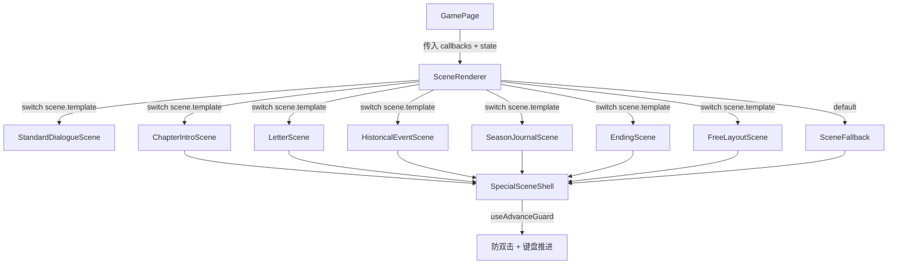

## 产品概述

在 `develop` 分支上实现统一场景渲染底层（P1A），将当前 `GamePage.tsx` 中硬编码的普通场景布局重构为按 `scene.template` 分发的七种场景渲染组件。

## 核心功能

### 模板审计结果

从 `game-data.json` 48 个场景中统计：

- **standardDialogue**: 43 个场景（主流对话场景）
- **chapterIntro**: 1 个场景（`prologue_time_skip`）
- **ending**: 2 个场景（`ending_electric_wave`, `ending_foreign_lamp`）
- **freeLayout**: 2 个场景（`journey_review`, `thank_you`，均无 `elements`）
- **letter**: 0 个场景
- **historicalEvent**: 0 个场景
- **seasonJournal**: 0 个场景

### 七种场景渲染组件

- `SceneRenderer` — 按 `scene.template` 穷尽分发，TypeScript 穷尽检查
- `StandardDialogueScene` — 保持现有 864px 场景区 + 216px 对话区 + 72px 状态栏，行为不退化
- `SpecialSceneShell` — 全屏外壳（1920×1080），背景、点击推进、键盘支持、双击保护
- `ChapterIntroScene` — 全屏章节介绍页，标题中心、小字档案排版
- `LetterScene` — 信纸居中，1-3 页翻页，最后一页才显示继续按钮
- `HistoricalEventScene` — 全屏历史事件页，旧报纸/档案视觉
- `SeasonJournalScene` — 全屏札记面板，只显示显性状态
- `EndingScene` — 结局全屏，显示标题和段落
- `FreeLayoutScene` — 按 `elements` 坐标/zIndex/opacity 渲染，无 elements 时安全降级
- `SceneFallback` — 未知模板或字段缺失时的安全降级页

### 特殊场景历史记录

- `sceneHistory.ts` 纯函数 `buildHistoryEntryFromScene`，统一生成特殊场景历史记录
- 每种模板对应不同历史记录规则，不写入隐藏数值

### 防双击重复推进

- `useAdvanceGuard` hook，场景切换时自动复位
- Enter/Space 键盘支持，输入控件聚焦时不误触

### 测试

- 4 个新测试文件覆盖 14 个测试场景
- 确保 P0/P0.1 原有 43 个测试全部继续通过

### 约束

- 不创建新分支，直接在 develop 上开发
- 不新增剧情、角色、结局
- 不修改 P0/P0.1 存档与回滚逻辑
- 不重写 gameStore 和 saveManager
- 不开发编辑器或完整音频系统

## 技术栈

- 前端框架：React 18 + TypeScript
- 状态管理：Zustand（现有 gameStore）
- 样式：CSS 变量体系（tokens.css）+ 新增 special-scenes.css
- 测试：Vitest + jsdom + @testing-library/react
- 构建：Vite 5

## 实现方案

### 架构设计

### 关键设计决策

1. **SceneRenderer Props 接口**：统一定义在 `sceneRendererTypes.ts`，包含 `scene`、`state`、`engine` 以及所有从 GamePage 传入的回调函数（`onAdvance`、`onSelectChoice`、`onConfirmCritical`、`onCancelConfirm`、`onRollback`、`showingChoices`、`pendingConfirm` 等）。

2. **StandardDialogueScene**：将 GamePage 中第 127-180 行的渲染逻辑完整迁移，不改变任何行为。GamePage 仅保留初始化逻辑（useEffect）、状态变量声明、以及 SceneRenderer 调用。

3. **SpecialSceneShell**：使用 `useAdvanceGuard` hook 防止双击。支持 `onClick` 背景推进和 Enter/Space 键盘推进。提供 `children` 插槽和底部统一按钮区域。

4. **sceneHistory.ts**：纯函数，不修改 store。在 `advanceScene` 被调用时，由 GamePage 通过 `buildHistoryEntryFromScene` 生成历史记录并调用 `recordHistoryEntry`。

5. **样式方案**：`special-scenes.css` 使用 CSS 类（`.special-scene-shell`、`.chapter-intro-title` 等），避免数百行内联样式。优先使用 `tokens.css` 中已有的 CSS 变量。

### 性能考虑

- 场景切换时 `useAdvanceGuard` 通过 `useEffect` 监听 `scene.id` 变化自动复位
- `getResolvedChoices` 已有缓存策略（场景切换时失效）
- 所有特殊场景组件为纯渲染组件，不持有复杂状态

### 文件变更清单

**新建文件（16 个）**：

- `src/components/scenes/sceneRendererTypes.ts` — 统一 Props 类型
- `src/components/scenes/SceneRenderer.tsx` — 分发器
- `src/components/scenes/StandardDialogueScene.tsx` — 普通对话场景
- `src/components/scenes/SpecialSceneShell.tsx` — 全屏外壳
- `src/components/scenes/useAdvanceGuard.ts` — 防双击 hook
- `src/components/scenes/ChapterIntroScene.tsx` — 章节介绍
- `src/components/scenes/LetterScene.tsx` — 家书
- `src/components/scenes/HistoricalEventScene.tsx` — 历史事件
- `src/components/scenes/SeasonJournalScene.tsx` — 季节札记
- `src/components/scenes/EndingScene.tsx` — 结局
- `src/components/scenes/FreeLayoutScene.tsx` — 自由排版
- `src/components/scenes/SceneFallback.tsx` — 安全降级
- `src/styles/special-scenes.css` — 特殊场景样式
- `src/engine/sceneHistory.ts` — 历史记录生成
- 4 个测试文件

**修改文件（2 个）**：

- `src/pages/GamePage.tsx` — 引入 SceneRenderer，简化渲染逻辑，添加特殊场景历史记录
- `PROGRESS.md` — 更新进度