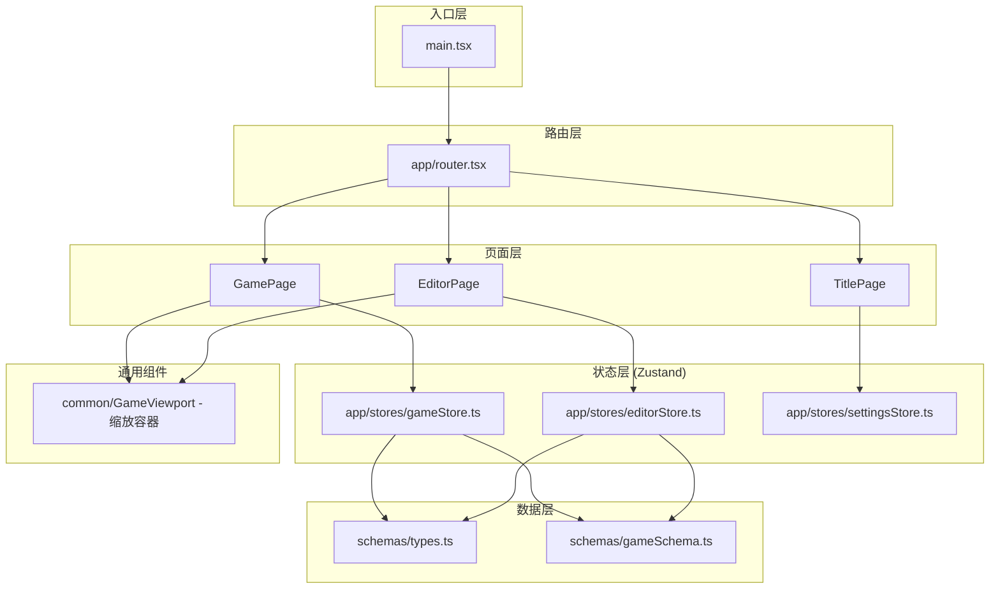

## 阶段 1 目标

严格按照《雪落之前》V1 主开发提示词，搭建完整的项目骨架。这是 8 个开发阶段中的第一步，完成后停止并汇报，不进入后续阶段。

## 核心要求

- 初始化 Vite + React + TypeScript 工程
- 安装全部固定技术栈依赖：React Router、Zustand、React Konva、Zod
- 建立文档规定的完整 `src/` 目录树结构
- 根据 `07_DATA_SCHEMA.md` 编写完整 TypeScript 类型定义
- 使用 Zod 编写数据校验 schema
- 创建三个独立的 Zustand store（游戏状态、编辑器状态、设置状态），不得混用
- 实现四路由结构：`/`（标题页）、`/game`（游戏运行器）、`/editor`（编辑器）、`/settings`（设置）
- 实现 1920×1080 逻辑画布等比例缩放容器组件
- 建立 CSS 变量体系（tokens.css + global.css）
- 生成一份最小测试用 `game-data.json`
- 仅使用测试数据，不做实际剧情内容

## 技术栈

| 层 | 技术选型 | 说明 |
| --- | --- | --- |
| 构建工具 | Vite 5 | 快速 HMR，TypeScript 原生支持 |
| UI 框架 | React 18 + TypeScript | 文档唯一指定 |
| 路由 | React Router v6 | SPA 回退支持，四路由 |
| 状态管理 | Zustand | 三个独立 store |
| 画布渲染 | React Konva | 编辑器/场景可视化 |
| 数据校验 | Zod | 导入导出 JSON 校验 |
| 样式 | CSS 变量 + CSS Modules | 不引入第三方 UI 库 |
| 持久化 | LocalStorage | V1 无后端 |


## 架构设计

### 系统分层



### 数据流

- `game-data.json` → Zod 校验 → `gameStore` 加载 → React 组件消费
- 用户交互 → `gameStore` 更新 → 组件重新渲染
- `editorStore` 管理编辑器草稿、撤销历史、画布元素状态
- `settingsStore` 管理音量、文字速度等简单键值
- LocalStorage 键名：`snow-before-v1-save`、`snow-before-v1-settings`、`snow-before-editor-draft`

### 目录结构

```
d:/new-dev/
├── index.html                          # [NEW] Vite 入口 HTML
├── package.json                        # [NEW] 项目配置与依赖声明
├── tsconfig.json                       # [NEW] TypeScript 配置
├── tsconfig.node.json                  # [NEW] Node 端 TS 配置
├── vite.config.ts                      # [NEW] Vite 配置，含 SPA 回退
├── docs/                               # [EXISTING] 8 份设计文档
├── public/
│   └── assets/                         # [EXISTING] 资源空目录
└── src/
    ├── main.tsx                        # [NEW] 应用入口，挂载 Router
    ├── vite-env.d.ts                   # [NEW] Vite 类型声明
    ├── app/
    │   ├── router.tsx                  # [NEW] 四路由定义
    │   └── stores/
    │       ├── gameStore.ts            # [NEW] 玩家运行时状态
    │       ├── editorStore.ts          # [NEW] 编辑器状态与 Undo
    │       └── settingsStore.ts        # [NEW] 音量、速度等设置
    ├── schemas/
    │   ├── types.ts                    # [NEW] 全部 TS 接口定义
    │   └── gameSchema.ts              # [NEW] Zod 校验 schema
    ├── components/
    │   ├── game/                       # [NEW_EMPTY] 游戏组件占位
    │   ├── editor/                     # [NEW_EMPTY] 编辑器组件占位
    │   └── common/
    │       └── GameViewport.tsx         # [NEW] 1920×1080 缩放容器
    ├── engine/
    │   ├── gameEngine.ts               # [NEW] 占位
    │   ├── conditionEvaluator.ts       # [NEW] 占位
    │   ├── effectApplier.ts            # [NEW] 占位
    │   ├── endingResolver.ts           # [NEW] 占位
    │   ├── saveManager.ts             # [NEW] 占位
    │   ├── historyManager.ts          # [NEW] 占位
    │   └── assetResolver.ts           # [NEW] 占位
    ├── content/
    │   └── game-data.json              # [NEW] 最小测试数据
    ├── pages/
    │   ├── TitlePage.tsx               # [NEW] 标题页占位
    │   ├── GamePage.tsx                # [NEW] 游戏页占位（含 viewport）
    │   ├── EditorPage.tsx              # [NEW] 编辑器页占位
    │   └── SettingsPage.tsx            # [NEW] 设置页占位
    └── styles/
        ├── tokens.css                  # [NEW] CSS 变量体系
        └── global.css                  # [NEW] 全局样式与重置
```

## 关键代码结构

### 三个 Zustand Store 设计

```ts
// gameStore.ts — 玩家运行时状态
interface GameStore {
  gameData: GameData | null;
  state: GameState | null;
  currentScene: SceneDefinition | null;
  loadGameData: (data: GameData) => void;
  startNewGame: () => void;
  applyChoice: (choiceId: string) => void;
  advanceScene: (sceneId: string) => void;
  // ... 状态读取方法
}

// editorStore.ts — 编辑器状态
interface EditorStore {
  scenes: Record<string, SceneDefinition>;
  selectedSceneId: string | null;
  selectedElementId: string | null;
  undoStack: EditorSnapshot[];
  redoStack: EditorSnapshot[];
  isDirty: boolean;
  // ... CRUD + Undo/Redo 方法
}

// settingsStore.ts — 设置
interface SettingsStore {
  masterVolume: number;
  musicVolume: number;
  sfxVolume: number;
  voiceVolume: number;
  textSpeed: "slow" | "normal" | "fast";
  isMuted: boolean;
  // ... 读/写/持久化方法
}
```

### GameViewport 缩放容器

```ts
// 核心逻辑：监听 window resize，计算等比缩放比例
// 容器按 (windowWidth / 1920) 与 (windowHeight / 1080) 中较小值缩放
// 子元素使用 1920×1080 逻辑坐标，通过 CSS transform: scale() 渲染
```